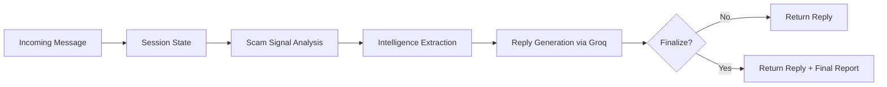

<p align="center">
  
  
</p>

<h1 align="center">🛡️ NIRIKSHA.ai</h1>
<h3 align="center">Agentic Honeypot for Scam Detection and Intelligence Extraction</h3>

<p align="center">
  <b>An autonomous, multi-turn AI honeypot that chats like a real person, keeps scammers engaged, and quietly collects actionable scam intelligence.</b>
</p>

<p align="center">
  
  
  
  
</p>

---

## 1. Overview

NIRIKSHA.ai is an **agentic honeypot** backend that pretends to be a normal person when a scammer sends a message. Unlike traditional anti-scam systems that block fraudsters immediately, NIRIKSHA.ai keeps them talking using believable, LLM-generated replies while silently extracting identifiable scam intelligence such as phone numbers, UPI IDs, bank account numbers, phishing links, and reference IDs. After sufficient engagement (~10 turns), the system produces a structured final report containing all extracted intelligence and a scam type classification. The project is a Python/FastAPI backend with a single REST endpoint, built for the India AI Impact Buildathon 2026.

---

## 2. Problem Statement

Traditional anti-scam tools block fraudsters immediately. While this protects the individual target, it reveals nothing about the scammer's identity, infrastructure, or methods. Scammers simply move on to the next victim. There is a need for a system that can engage scammers in conversation to extract actionable intelligence before they realize they are being monitored.

---

## 3. Core Idea

Deploy an LLM-powered agent that mimics a cautious, slightly confused person. The agent engages the scammer across multiple conversation turns, strategically asking for identifying details (reference numbers, email addresses, phone numbers, UPI IDs, bank accounts, verification links) while never revealing that it is an AI or that it recognizes the scam.

---

## 4. Features

### Implemented

| Feature | Description |
|---|---|
| Multi-turn conversation engine | Maintains per-session state across turns using in-memory dicts |
| LLM reply generation | Groq API with Llama 3.3 70B; persona-driven system prompt; temperature 0.8 |
| Scam signal scoring | Regex-based cumulative scoring for urgency, OTP requests, payment pressure, suspicious artifacts |
| Intelligence extraction | Regex extraction of phone numbers, bank accounts, UPI IDs, phishing links, emails, case IDs, policy numbers, order numbers, reference IDs |
| Deduplication and normalization | Sets for all categories; phone normalization (+91); UPI vs email disambiguation; epoch timestamp filtering |
| Reply sanitization | Banned word removal (honeypot, bot, ai, fraud, scam); single-question enforcement; 200-char cap |
| Rubric-aware generation | Tracks question count, investigative wording, red flag mentions, elicitation attempts per session |
| Context-aware hint system | Determines next intel topic to ask about based on what is still missing |
| Final report generation | Triggered at turn 10 (or turn 8 with sufficient intel); includes LLM scam classification |
| API key authentication | x-api-key header validated against API_SECRET_KEY env var |
| Human delay simulation | Configurable async sleep (0.10 to 0.28 seconds) |
| Test/evaluation harness | 5 scam scenarios with weighted scoring (detection, extraction, quality, engagement, structure) |

### Partial

| Feature | Description |
|---|---|
| Logging | `print()` to stdout only. No structured logging, no log files. |
| Error handling | try/except around LLM calls, fallback to static reply. No error tracking. |

### Not Implemented

| Feature | Description |
|---|---|
| Database / persistent storage | All state in-memory. Lost on restart. |
| Frontend / dashboard | No UI. API-only. |
| Rate limiting | No protection against abuse. |
| Session cleanup / TTL | Memory grows unbounded. |
| CORS | Not configured. |
| Containerization | No Dockerfile. |
| CI/CD | No GitHub Actions or similar. |
| Unit tests | test_chat.py is an integration harness, not pytest. |
| Webhook delivery | finalCallback returned in response, not POSTed. |
| Input sanitization | No XSS protection. |

---

## 5. System Workflow

```
1. Receive POST /api/detect with sessionId, message, conversationHistory
2. Validate API key (x-api-key header)
3. Initialize or update in-memory session state
4. Compute scam signals (regex-based, cumulative score)
5. Extract intelligence from the full conversation text (regex)
6. Choose a natural "next hint" topic (what intel to ask for)
7. Generate reply via Groq Llama 3.3 70B
8. Sanitize reply (banned words, question limit, length cap)
9. Enforce rubric minimums on designated turns
10. If finalization condition met (turn >= 10, or turn >= 8 with enough intel):
    - Run LLM scam type classification
    - Build and attach final report
11. Return JSON response
```



---

## 6. Tech Stack

| Layer | Technology | Purpose |
|---|---|---|
| Language | Python 3.10+ | Core application language |
| Framework | FastAPI | Async REST API with auto-validation |
| LLM Provider | Groq | Ultra-fast inference engine for LLM calls |
| Model | Meta Llama 3.3 70B | Powers conversation and scam classification |
| Validation | Pydantic v2 | Request/response schema validation |
| Server | uvicorn | ASGI server |
| Deployment | Railway | Cloud hosting with HTTPS and auto-deploy |

---

## 7. Project Structure

```
NIRIKSHA.ai/
├── src/
│   ├── main.py                    # Entire backend (626 lines): config, session state,
│   │                              # models, regex patterns, scam scoring, extraction,
│   │                              # LLM reply generation, sanitization, final report,
│   │                              # API endpoint, server runner
│   └── tests/
│       └── test_chat.py           # Integration test: 5 scam scenarios with scoring
├── docs/                          # Empty (planned for documentation)
├── requirements.txt               # fastapi, uvicorn, requests, python-dotenv, groq, pydantic
├── .env.example                   # Template: GROQ_API_KEY, API_SECRET_KEY
├── .gitignore                     # Python defaults + .env, .venv, ngrok.exe
├── PROJECT_AUDIT.md               # Detailed technical audit
├── STATUS_FOR_CHATGPT.md          # AI-readable project status
├── FEATURE_MATRIX.md              # Feature status table (36 features)
└── README.md                      # This file
```

---

## 8. API Endpoints / Interfaces

### POST /api/detect

**Headers:**

| Header | Value | Required |
|---|---|---|
| Content-Type | application/json | Yes |
| x-api-key | Must match `API_SECRET_KEY` | Yes |

**Request Body:**

```json
{
  "sessionId": "uuid-v4-string",
  "message": {
    "sender": "scammer",
    "text": "URGENT: Your account has been compromised...",
    "timestamp": "2025-02-11T10:30:00Z"
  },
  "conversationHistory": [
    { "sender": "scammer", "text": "Previous message...", "timestamp": 1739269800000 },
    { "sender": "user", "text": "Previous reply...", "timestamp": 1739269860000 }
  ],
  "metadata": { "channel": "SMS", "language": "English", "locale": "IN" }
}
```

> **Aliases:** `sessionId` also accepted as `sessionld` or `session_id`. `conversationHistory` also accepted as `conversation_history`. `metadata` is optional.

**Success Response (normal turn):**

```json
{
  "status": "success",
  "reply": "Oh no, that sounds serious. What is the reference number for this?",
  "finalCallback": null,
  "finalOutput": null
}
```

**Success Response (with final report):**

```json
{
  "status": "success",
  "reply": "I see, let me note that down.",
  "finalCallback": {
    "sessionId": "abc123",
    "status": "completed",
    "scamDetected": true,
    "totalMessagesExchanged": 18,
    "engagementDurationSeconds": 240,
    "scamType": "bank_fraud",
    "confidenceLevel": 0.92,
    "extractedIntelligence": {
      "phoneNumbers": ["+919876543210"],
      "bankAccounts": ["1234567890123456"],
      "upiIds": ["scammer@fakeupi"],
      "phishingLinks": ["http://fake-site.com"],
      "emailAddresses": ["support@fakebank.com"],
      "caseIds": ["CASE-12345"],
      "policyNumbers": [],
      "orderNumbers": [],
      "referenceIds": ["CASE-12345"]
    },
    "engagementMetrics": {
      "totalMessagesExchanged": 18,
      "engagementDurationSeconds": 240
    },
    "agentNotes": "Session completed. scamType=bank_fraud."
  },
  "finalOutput": { "...same as finalCallback..." }
}
```

**Error Responses:**

| Status | Condition |
|---|---|
| 403 | Missing or incorrect API key |
| 422 | Invalid request shape (Pydantic validation) |

---

## 9. Setup Instructions

### Prerequisites

- Python 3.10 or higher
- A Groq API key ([get one here](https://console.groq.com/keys))

### Installation

```bash
git clone https://github.com/ABHI99RAJPUT/NIRIKSHA.ai.git
cd NIRIKSHA.ai

python -m venv .venv
# Windows
.venv\Scripts\activate
# macOS / Linux
source .venv/bin/activate

pip install -r requirements.txt
```

---

## 10. Environment Variables

Create a `.env` file in the project root (copy from `.env.example`):

```env
GROQ_API_KEY=your_groq_key_here
API_SECRET_KEY=your_api_key_here
```

**Optional:**

```env
GROQ_MODEL=llama-3.3-70b-versatile    # Default model
MIN_HUMAN_DELAY_S=0.10                 # Min simulated delay
MAX_HUMAN_DELAY_S=0.28                 # Max simulated delay
PORT=8000                              # Server port
```

> **Important:** If `API_SECRET_KEY` is empty or missing, all requests will fail with HTTP 403. If `GROQ_API_KEY` is missing, the server will crash on startup.

---

## 11. How to Run

### Start the server

```bash
uvicorn src.main:app --reload --host 0.0.0.0 --port 8000
```

Or directly:

```bash
python src/main.py
```

**Local endpoint:** `http://127.0.0.1:8000/api/detect`

### Run tests

```bash
# First, edit API_KEY in src/tests/test_chat.py to match your API_SECRET_KEY
python src/tests/test_chat.py
```

### cURL example

```bash
curl -X POST "http://127.0.0.1:8000/api/detect" \
  -H "Content-Type: application/json" \
  -H "x-api-key: YOUR_API_SECRET_KEY" \
  -d '{
    "sessionId": "test-001",
    "message": {
      "sender": "scammer",
      "text": "Your account is blocked. Send OTP now.",
      "timestamp": "2025-02-11T10:30:00Z"
    },
    "conversationHistory": []
  }'
```

---

## 12. Example Input/Output

**Input (Turn 1):**
```json
{
  "sessionId": "demo-session-001",
  "message": { "sender": "scammer", "text": "URGENT: Your SBI account has been blocked. Share OTP immediately.", "timestamp": "2026-03-17T10:00:00Z" },
  "conversationHistory": []
}
```

**Output (Turn 1):**
```json
{
  "status": "success",
  "reply": "Oh no, that sounds serious. Can you share the reference number for this?",
  "finalCallback": null,
  "finalOutput": null
}
```

**Input (Turn 10 - finalization):**
After 10 turns of conversation, the response will include a `finalCallback` object with the complete report.

---

## 13. Current Status

| Category | Status |
|---|---|
| API endpoint | Working (local + Railway) |
| Multi-turn conversations | Working |
| LLM reply generation | Working |
| Intelligence extraction | Working |
| Final report generation | Working |
| Test harness | Working (requires running server) |
| Persistent storage | Not implemented |
| Frontend / dashboard | Not implemented |
| Rate limiting | Not implemented |
| Containerization | Not implemented |
| CI/CD | Not implemented |
| Unit tests | Not implemented |

**Overall classification: Research Prototype / Hackathon Submission**

---

## 14. Limitations

1. **No persistence:** All session data is stored in-memory and lost on server restart.
2. **No frontend:** Interaction is API-only; no visual dashboard exists.
3. **Single-file architecture:** All 626 lines of logic are in `src/main.py`.
4. **Hardcoded scam detection:** `scamDetected` is always `True` in the final report.
5. **Duration inflation:** Engagement duration is artificially boosted for sessions with 16+ messages.
6. **Memory leak:** Session dicts grow unbounded with no cleanup mechanism.
7. **Single API key:** No per-user authentication or multi-tenancy.
8. **No rate limiting:** The endpoint has no abuse protection.
9. **Regex-only extraction:** No ML-based entity extraction; relies entirely on regex patterns.
10. **India-focused:** Phone number patterns are India-specific (+91, starting with 6-9).

---

## 15. Future Scope

1. Add persistent storage (SQLite or PostgreSQL) for sessions, conversations, and extracted intelligence
2. Build a web dashboard to view live conversations, extracted data, and reports
3. Refactor into modular architecture (separate routes, services, models, extraction, config)
4. Add ML-based entity extraction alongside regex
5. Support multiple communication channels (SMS, WhatsApp, email)
6. Add real-time alerting when high-confidence scams are detected
7. Implement webhook delivery for final reports
8. Add multi-language support
9. Build a scam pattern analysis module that identifies trends across sessions
10. Add Docker containerization and CI/CD pipeline

---

## 16. Notes for Research / Mini Project Use

- **Research direction:** The core idea of using an LLM agent as a honeypot for scam intelligence extraction is novel and publishable. The key contribution is the agentic conversation loop that maintains a believable persona while strategically eliciting information.
- **For a research paper:** You would need a dataset of real or realistic scam conversations, baseline comparisons (e.g., template-based vs LLM-based engagement), quantitative evaluation metrics, and ethical considerations.
- **For a mini project/hackathon submission:** The current codebase is sufficient. Focus on demonstrating the conversation flow, extraction accuracy, and the final report.
- **Evaluation:** The included `test_chat.py` provides a weighted scoring framework across 5 scam scenarios.

---

## 17. Team

<table>
  <tr>
    <td align="center">
      <b>Vanshaj Garg</b><br/>
      📧 <a href="mailto:official.vanshaj.garg@gmail.com">official.vanshaj.garg@gmail.com</a><br/>
      🔗 <a href="https://www.linkedin.com/in/vanshajgargg">LinkedIn</a>
    </td>
    <td align="center">
      <b>Abhishek Rajput</b><br/>
      📧 <a href="mailto:rajputabhishek512@gmail.com">rajputabhishek512@gmail.com</a><br/>
      🔗 <a href="https://www.linkedin.com/in/abhi-99-rajput/">LinkedIn</a>
    </td>
    <td align="center">
      <b>Abhay Raj Yadav</b><br/>
      📧 <a href="mailto:19abhay26@gmail.com">19abhay26@gmail.com</a><br/>
      🔗 <a href="https://www.linkedin.com/in/contactabhayraj">LinkedIn</a>
    </td>
  </tr>
</table>

---

## 18. License

Built for the **India AI Impact Buildathon 2026** organized by HCL GUVI under the India AI Impact Summit.

No open-source license file is currently included in the repository.

---

<p align="center">
  <b>🛡️ NIRIKSHA.ai</b><br/>
  <i>Because the best defense is making the attacker's offense work against them.</i><br/><br/>
  <b>Fighting scams. Extracting intelligence. Wasting scammer time.</b>
</p>
